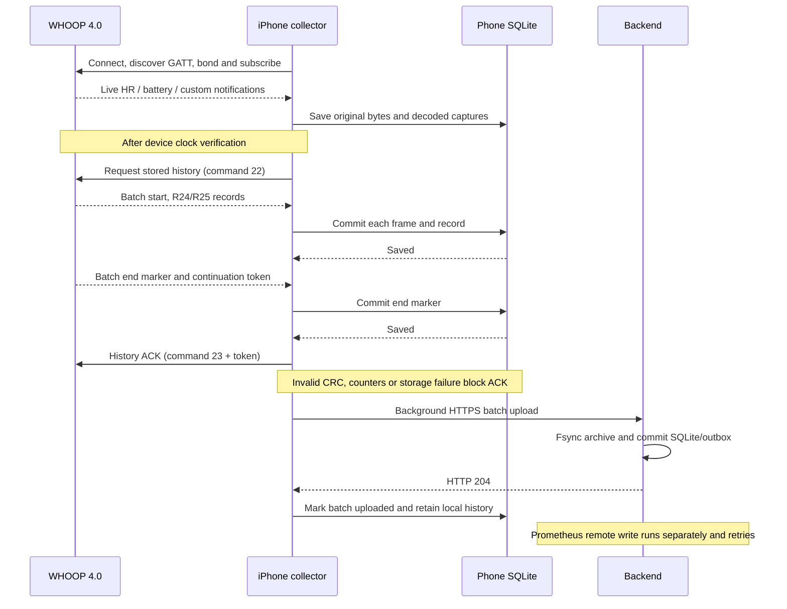

# Bluetooth transport and signal coverage

Life talks directly to a WHOOP 4.0 through CoreBluetooth. The standard Bluetooth
services supply live HR and battery data. WHOOP's custom service carries commands,
responses, events and stored history. No WHOOP cloud API participates in this path.

The current firmware-derived physiological decoders target **Harvard 41.17.4.0**.
Discovering a characteristic or preserving a packet does not establish its units,
sensor identity or physiological accuracy. WHOOP 5.0 and MG are not supported by
these mappings.

## GATT map

WHOOP UUIDs below share the suffix `-8d6d-82b8-614a-1c8cb0f8dcc6`.

| Service / characteristic | Direction | Life behavior |
| --- | --- | --- |
| `180D` / `2A37` Heart Rate Measurement | Strap → phone | Subscribe; decode BPM and contact flags; preserve optional interval words. |
| `180F` / `2A19` Battery Level | Strap → phone | Read and subscribe when supported; decode the one-byte percentage. |
| `61080001…` custom service | Both | Discover characteristics; preserve service UUIDs and properties. |
| `61080002…` command characteristic | Phone → strap | Serialized command writes, including battery, firmware, clock and history requests. |
| `61080003…` response characteristic | Strap → phone | Receive framed command responses; required before normal live setup completes. |
| `61080005…` data characteristic | Strap → phone | Receive custom data/history frames; required before normal live setup completes. |
| Other custom notify/indicate characteristics | Strap → phone | Subscribe after bonding; preserve original fragments and valid complete frames. |
| Optional `180A`, `1809`, `1822` services | Strap → phone | Inventory/read/subscribe if exposed. This is not evidence of an available standard thermometer or oximeter measurement. |

A custom battery query initiates bonding. Life waits for the response, data and HR
notification subscriptions before starting live collection. Recovery attempts restart
missing notifications, then reconnect if needed. It uses CoreBluetooth restoration,
persisted reconnect intent and callbacks as well as timers; iOS may suspend timers.

## Stored history and acknowledgements

The two acknowledgements mean different things: the strap ACK confirms that the
phone saved the history; HTTP 204 confirms that the backend saved the upload.
Neither means Prometheus has already accepted every numeric sample.

Custom frame parsing checks the `0xAA` prefix, declared length, header CRC8 and body
CRC32. Reassembly is separate per characteristic. Original fragments, including
unrecognized or corrupt data, remain archived; invalid frames do not become decoded
measurements. Stored-history continuation requires known frame sizes, consecutive
counters within each revision and the verified end-marker layout. R24 and R25 have
independent counters. Unknown layouts pause history ACK instead of guessing.

## Decoded and archived signals

**Decoded** means a field mapping is established for the supported path. **Derived**
means Life computes a result from decoded inputs. **Research only** means bytes or
candidate arrays are retained without a validated health interpretation.

All byte offsets below are absolute within the complete framed packet. Multi-byte
R24 fields are little-endian. R24 is packet type `0x2F`, revision `24`, length `104`.

| Signal / layout | Mapping | Status and downstream use |
| --- | --- | --- |
| Standard live HR | `2A37`: flags select 8- or 16-bit BPM; contact flag when present | Decoded. Timestamped at phone receipt; off-wrist and acquisition readings are excluded from HR metrics. |
| Custom live HR | `0x28`, revision `2`, length `28`: BPM at `12`, seconds at `6`, fraction at `10` / `32768` | HR/clock decoded for research and clock verification. Main live charts use standard HR notifications. |
| Standard live interval words | Optional `2A37` interval array | Research only. Preserved as raw words; not converted into production HRV. |
| Historical HR and time | R24: counter at `7`, seconds at `11`, fraction at `15` / `32768`, BPM at `21` | Decoded. Original timestamps feed HR history and cardio-load calculations; invalid clocks are withheld. |
| Historical pulse intervals | R24: count at `22`, up to four `uint16` words starting at `23` | Firmware-established chronological milliseconds. Input to five-minute RMSSD and experimental breathing estimates. |
| Skin temperature | R24: signed `int16` at `76` / `10` °C | Firmware-established wrist reading. Sensor-error sentinel `700` is withheld. No core-temperature offset. |
| Device oxygen result | R24: byte `86` | Firmware-established output/status path. Accept `70–100` except ambiguous `98`; zero and error codes are not saturation readings. |
| Optical configuration | R24 words at `78`, `80`, `82` | Identified as channel/configuration bitfields. Not respiratory rate, wavelengths or a physiological quality score. |
| Battery percentage | `2A19` plus custom command `26` response, deci-percent / `10` | Decoded. Publish only when readings arrive within 30 seconds and agree within one percentage point. |
| Battery event fields | `0x30`, event `3`, length `40`: candidate percentage at `17`, voltage at `21`, flags at `26` | Research only. These fields do not replace the battery cross-check. |
| Motion channels | `0x2B`, revision `10/11`, length `1928/1932`: six candidate 100-sample signed arrays | Research only. Axis labels, sample rate and conversion to g or degrees/s are not validated. |
| Optical waveforms | `0x2B`, revision `21`, length `1244`: six candidate 100-sample unsigned arrays | Research only. No confirmed red/infrared waveform pair or independent saturation calculation. |
| Alternate interval layout | `0x2B`, revision `17`: bounded interval array | Research only. Units, ordering and device support remain unverified. |
| R25 stored history | `0x2F`, revision `25`, length `84` | Counter checked for transfer continuity; payload archived without health decoding. |
| Events, metadata, command replies and unknown layouts | `0x30`, `0x31`, `0x24` and other complete frames | Preserve payloads and known IDs. Only specific verified response schemas drive behavior. |

Normal collection does not enable continuous raw motion/optical streaming. The app
has a separate, bounded foreground sensor-research capture. A candidate decoder's
presence in the source is not proof that a particular strap emits that layout.

The numerical analysis service requires timestamped firmware evidence, coverage and
signal checks. It records rejected-window reasons. HRV is PPG-derived pulse variability,
not an ECG measurement. Breathing is an estimate from pulse timing; no device-computed
breathing-rate field has been identified. No confidence percentage or clinical accuracy
is inferred from passing software checks.

Strain, sleep-duration scores and overnight summaries are computed in the backend;
they are not decoded score fields on the Bluetooth link. Sleep times and targets come
from the user's journal/profile. [Exact scoring methods](SCORING.md).

## Source map

| Responsibility | Source |
| --- | --- |
| GATT discovery, bonding, subscriptions, reconnect and capture | [Collector.swift](../Sources/WhoopCollector/Collector.swift), [ConnectionRecovery.swift](../Sources/WhoopCore/ConnectionRecovery.swift) |
| Framing, HR and battery parsing | [Protocol.swift](../Sources/WhoopCore/Protocol.swift) |
| Persist-before-ACK history state machine | [HistoryTransfer.swift](../Sources/WhoopCore/HistoryTransfer.swift) |
| Phone persistence and uploads | [Store.swift](../Sources/WhoopCore/Store.swift), [Uploader.swift](../Sources/WhoopCollector/Uploader.swift) |
| Offline layout and candidate decoders | [whoop_protocol.py](../backend/whoop_protocol.py) |
| Temperature, HRV and oxygen / respiration | [temperature.py](../backend/temperature.py), [hrv.py](../backend/hrv.py), [vitals.py](../backend/vitals.py), [respiration.py](../backend/respiration.py) |
| Incremental analysis and scoring | [hrv_analysis.py](../backend/hrv_analysis.py), [wellness.py](../backend/wellness.py) |

Firmware traces and validation limits: [HRV](HRV.md), [temperature](TEMPERATURE.md),
[oxygen and breathing](RESPIRATION-OXYGEN.md), [history recovery tests](RELIABILITY.md).
Earlier capture snapshots and research provenance are in [protocol research](PROTOCOL-RESEARCH.md).

## Feature comparison scope

The README compares implemented Life functionality with WHOOP's documented features
for WHOOP 4.0. It is a coverage comparison, not an accuracy study or a claim to reproduce
WHOOP's proprietary algorithms. WHOOP subscription tiers and newer-device features are
outside this comparison.

WHOOP's [Health Monitor](https://www.whoop.com/us/en/thelocker/health-monitor-feature/)
lists HR, HRV, respiratory rate, SpO₂, skin temperature and resting HR. Its
[data-export documentation](https://support.whoop.com/s/article/How-to-Export-Your-Data)
also lists strain, recovery and sleep outputs. Life's sleep journal and duration score
provide a smaller, manual feature set than WHOOP's
[activity and sleep detection](https://support.whoop.com/s/article/Automatic-and-Manual-Activity-Detection).

Other WHOOP features not implemented in Life include
[stress monitoring](https://www.whoop.com/us/en/press-center/whoop-launches-new-stress-monitor-feature-first-wearable-to-measure-daily-stress-levels-and-implement-stress-reduction-interventions-in-real-time/),
[steps](https://support.whoop.com/s/article/Steps),
[calorie estimates](https://support.whoop.com/s/article/How-does-WHOOP-calculate-calories-burned),
and the [haptic alarm](https://support.whoop.com/s/article/The-Haptic-Alarm-Dashboard?language=en_US).
